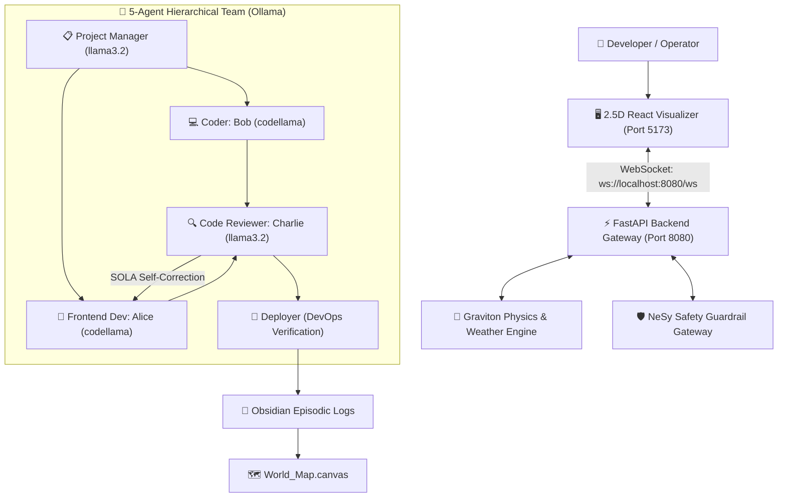

# 🌐 Autonomous Multi-Agent Open World & Software Engineering Workshop

[](https://github.com/Escobar96-max/open-world-multi-agent-workshop/actions/workflows/agent-publish.yml)
[](https://fastapi.tiangolo.com)
[](https://reactjs.org)
[](https://vitejs.dev)
[](https://tailwindcss.com)
[](https://ollama.ai)
[](https://obsidian.md)

A complete, local, five-agent hierarchical software engineering workshop and interactive 2.5D open-world simulation powered by local Ollama LLMs (`llama3.2` & `codellama`), FastAPI WebSocket telemetry streaming, and Obsidian persistent knowledge graph memory.

---

## 🌟 Key Architecture & Highlights



- **5-Agent Hierarchical Software Team**:
  - `Project Manager` (`llama3.2`): Task planning and decomposition.
  - `Coder / Bob` (`codellama`): Backend Python logic & Euclidean distance calculators.
  - `Frontend Developer / Alice` (`codellama`): Glassmorphic React components and Tailwind styling.
  - `Code Reviewer / Charlie` (`llama3.2`): Neuro-symbolic safety policies and SOLA self-correction framework.
  - `Deployer` (`codellama`): Automated testing, subprocess execution, and build mounting.
- **FastAPI + WebSockets Backend**: Streams real-time agent positions, weather physics (lightning flashes, rain streaks, wind velocity), and gravity mutations.
- **2.5D Open World Visualizer**: 60FPS canvas floor plan displaying Bob, Alice, and Charlie physically responding to gravity, anomalies, and weather.
- **Obsidian Vault & Canvas Mapping**: Real-time episodic markdown notes and spatial desk tracking inside `World_Map.canvas`.

---

## 🚀 Quick Start & Installation

### 1. Prerequisites
- **Python 3.12+** or **3.14+**
- **Node.js 18+** or **20+**
- **Ollama**: [Download Ollama](https://ollama.ai)

### 2. Pull Required Models
```bash
ollama pull llama3.2
ollama pull codellama
```

### 3. One-Click Launch
**On Windows (PowerShell):**
```powershell
.\start-dev-team.ps1
```

**On Linux / macOS (Bash):**
```bash
chmod +x start-dev-team.sh
./start-dev-team.sh
```

---

## 🛠️ Manual Execution & Development

### Backend Gateway (FastAPI + WebSockets)
```bash
pip install -r requirements.txt
python agent-web-server.py
```
- **REST Status**: `http://localhost:8080/api/status`
- **WebSocket Feed**: `ws://localhost:8080/ws`

### Frontend Visualizer (React + Tailwind + Vite)
```bash
npm install
npm run dev
```
Open **[http://localhost:5173](http://localhost:5173)** in your browser.

### Multi-Agent Lifecycle Execution
```bash
python ollama-developer-team-v2.py
```

---

## 📂 Repository Structure

```
├── .github/workflows/
│   └── agent-publish.yml           # CI/CD test and build pipeline
├── src/
│   ├── open-world-visualizer.jsx   # 2.5D Interactive open-world canvas
│   ├── App.jsx                     # Top-level view switcher
│   ├── main.jsx                    # Vite entry point
│   └── index.css                   # Tailwind styles
├── ollama-developer-team-v2.py     # 5-Persona collaborative development loop
├── agent-web-server.py             # FastAPI + WebSockets communication engine
├── agent-safety-guardrails.py      # Neuro-Symbolic guardrail interceptor
├── agent-influence-map.py          # Spatial comfort & hazard calculation matrix
├── sim_engine.py                   # Graviton physics & weather simulation
├── obsidian-translucent-dark.css   # Glassmorphic editor theme
├── start-dev-team.ps1              # One-click launcher (PowerShell)
├── start-dev-team.sh               # One-click launcher (Bash)
├── requirements.txt                # Python backend dependencies
├── package.json                    # Node dependencies & scripts
├── vite.config.js                  # Vite bundler configuration
└── README.md                       # Documentation
```

---

## 📄 License
MIT License. Created by [Escobar96-max](https://github.com/Escobar96-max).
